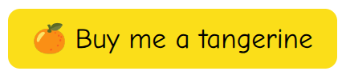

### Hello, I'm Tri👋 

## I am a AI Software Engineer 
- 💬 Languages & Technologies: Shell, C, C++, Python
- 👀 I’m interested in both work and research focusing on Computer Vision and Artificial Intelligence within industrial projects. My primary goal is to pursue a career as an AI Engineer, with a strong passion for developing practical AI applications. My expertise lies in areas such as Multi-Object Tracking and Re-Identification, Pose Estimation, and Object Detection. Also love to work with LLM projects, 
- 📫 How to reach me: triledinh102097@gmail.com
- ⚡ Fun fact: I love taking the photograph!
- 😄 More of my projects are being uploaded in my spare time: https:/trild.org

### Connect with me

 
 

<!-- ### Github Stats

	
	

	
	

 -->

 

<!-- ##  📫 My contributions so far!
 -->
